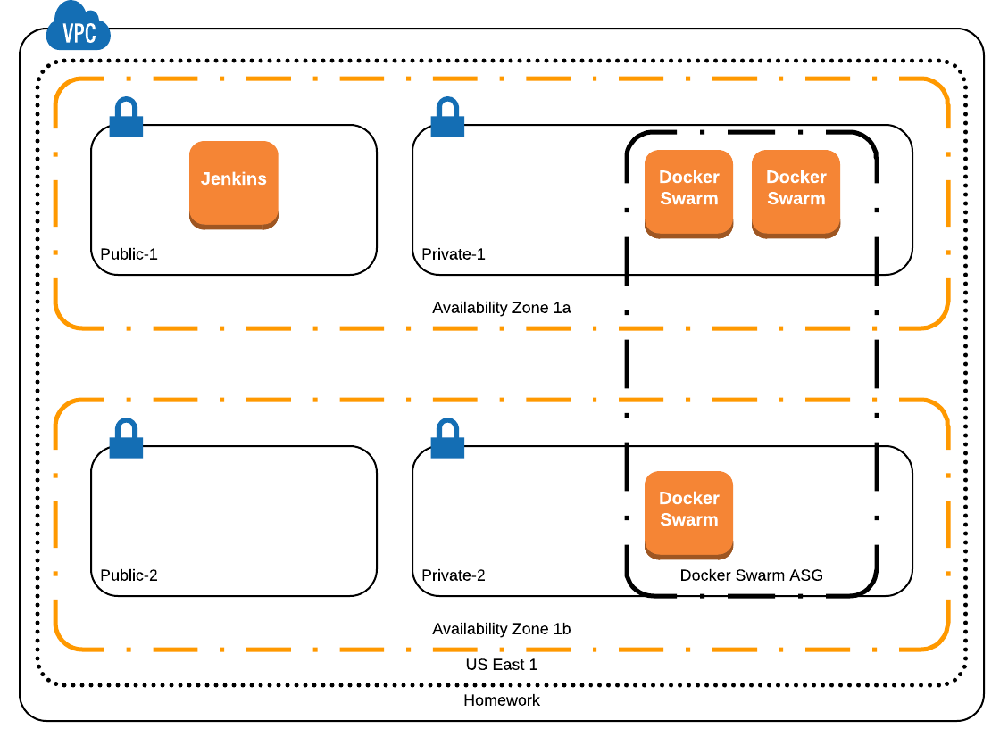

# Interview Homework
This exercise is designed to access the candidate's ability to build and dep

## Scenario
Create a Lambda function that returns the number of EC2 Instances that have a specific tag.

## What You Will Need
1.  An AWS Account
2.  A GitHub account

Things that need to be included:

Create a lambda script that connects to a given AWS account and searches it for a tag and then does something simple.

If you need to do something, include instructions on how to build the Lambda package. (i.e. extra python packages)

